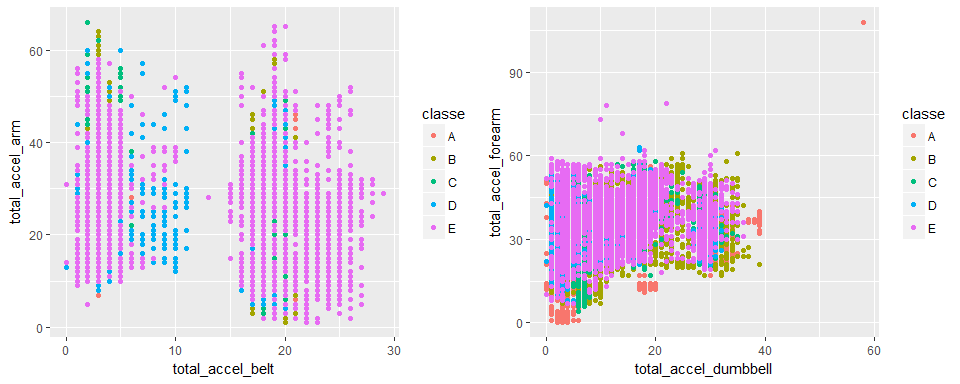
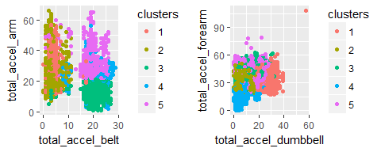
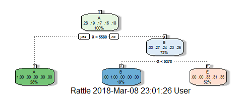

## Background
Six young health participants were asked to perform one set of 10 repetitions of the Unilateral Dumbbell Biceps Curl in five different fashions: exactly according to the specification (Class A), throwing the elbows to the front (Class B), lifting the dumbbell only halfway (Class C), lowering the dumbbell only halfway (Class D) and throwing the hips to the front (Class E).  The data provided recorded features on the Euler angles (roll, pitch and yaw), as well as the raw accelerometer, gyroscope and magnetometer readings. For the Euler angles of each of the four sensors, eight features recorded are: mean, variance, standard deviation, max, min, amplitude, kurtosis and skewness, generating in total 96 derived feature sets.

## Aim of the Project
The purpose of the project is to predict how well the people did the exercise. A prediction model will be built using the training dataset and subsequently applied on the testing dataset.   

## Data Exploration and Preprocessing

In exploring the data, we notice that the testing dataset has several columns, where all values are "NA". There is also one variable "problem_id" in the testing dataset that not found in training dataset. These variables could not be considered as predictors. Upon filtering, we have 60 variables in the training_explore dataset, including "classe". Checks revealed that there are no missing values in these 60 variables in this training_explore dataset.


```r
testing_explore<-testing[ , ! apply( testing , 2 , function(x) all(is.na(x)) ) ]
str(testing_explore)

##Note that "problem_id" - 60th column of testing_explore[60] is not found in training set
names(testing_explore)[60]
subset<-names(testing_explore)[1:59]

##Sieve out training set with variables the same as testing set
training_explore<-select(training,subset,classe)

## There are zero rows with incomplete cases
sum(!complete.cases(training_explore))
```

We then proceed to partition the training_explore dataset 70:30 into a **trainData** set (of 13,737 data points) for building the model and a **validation** set (of 5,885 data points). 


```r
set.seed(95014)
inBuild<-createDataPartition(y=training_explore$classe,p=0.7,list=FALSE)
validation<-training_explore[-inBuild,]
trainData<-training_explore[inBuild,]
```
Further exploration of the variables in the trainData revealed that many variables (46 to be exact) are highly correlated. Therefore we do not use linear discriminant analysis method in our model building, as this method (like regression techniques) involves computing a matrix inversion, which is inaccurate if the determinant is close to 0 (i.e. two or more variables are almost a linear combination of each other). It also makes the estimated coefficients impossible to interpret. 

```r
##Checking Collinearity (excluding variables like X, user_name and new_window as they are not meanful to be predictors)
trainDatasubset<-trainData[8:59] 
trainDatasubset <- mutate_all(trainDatasubset, function(x) as.numeric(as.integer(x)))
M<-abs(cor(trainDatasubset))
```

```
## Warning in cor(trainDatasubset): the standard deviation is zero
```

```r
diag(M)<-0
x<-which(M>0.8,arr.ind = T)
length(x)
```

[1] 92

### Model Building

We first build a **random forest model** using the trainData set and test its accuracy on the validation dataset.

```r
cluster <- makeCluster(detectCores() - 1) # convention to leave 1 core for OS
registerDoParallel(cluster)

fitControl <- trainControl(method = "cv",
                           number = 5,
                           allowParallel = TRUE)

mod1<-train(classe~.-X -user_name -new_window, data=trainData,method="rf", trControl = fitControl)
pred<-predict(mod1,trainData)
confusionMatrix(pred, trainData$classe)$overall[1]
```

Accuracy 
       1 

```r
pred1<-predict(mod1,validation)
confusionMatrix(pred1, validation$classe)$overall[1]
```

 Accuracy 
0.9996602 

```r
#table(pred1,validation$classe)
sqrt(sum(pred1!=validation$classe)^2)
```

[1] 2

The **accuracy of the random forest model** on the validation dataset is **99.96602%!** (and it is 100% accurate on the trainData set)! From the above table, we note that there are only 2 data points (out of 5885) that are predicted incorrectly. That is, the **expected out of sample error** is **0.0003398**.

The accuracy level is higher than the **boosted trees model**, which achieved an accuracy of 99.76211%! for the validation dataset, with 11 data points predicted incorrectly (see results below). As we do not wish to overfit the data, we choose not to combine these two predictors. The natural choice for the prediction model is the **random forest model**.


```
## Iter   TrainDeviance   ValidDeviance   StepSize   Improve
##      1        1.6094             nan     0.1000    0.2526
##      2        1.4478             nan     0.1000    0.1772
##      3        1.3333             nan     0.1000    0.1466
##      4        1.2406             nan     0.1000    0.1236
##      5        1.1627             nan     0.1000    0.1108
##      6        1.0921             nan     0.1000    0.0874
##      7        1.0375             nan     0.1000    0.0931
##      8        0.9795             nan     0.1000    0.0777
##      9        0.9315             nan     0.1000    0.0757
##     10        0.8843             nan     0.1000    0.0691
##     20        0.5792             nan     0.1000    0.0346
##     40        0.2941             nan     0.1000    0.0148
##     60        0.1662             nan     0.1000    0.0077
##     80        0.1040             nan     0.1000    0.0042
##    100        0.0697             nan     0.1000    0.0026
##    120        0.0489             nan     0.1000    0.0013
##    140        0.0351             nan     0.1000    0.0008
##    150        0.0303             nan     0.1000    0.0005
```

```
##  Accuracy 
## 0.9976211
```

```
##      
## pred2    A    B    C    D    E
##     A 1671    2    0    0    0
##     B    3 1137    0    0    0
##     C    0    0 1022    0    0
##     D    0    0    4  963    4
##     E    0    0    0    1 1078
```

## Conclusion
The **random forest model** is chosen to predict how well the six people did the exercise. After having applied the model on the testing data, the model achieves a **100% accuracy**.

## Appendix

## Exploratory Data Analysis Figures 

### Plainly Exploratory

```r
plotclasse1<-qplot(total_accel_belt,total_accel_arm,colour=classe,data=trainData)
plotclasse2<-qplot(total_accel_dumbbell,total_accel_forearm,colour=classe,data=trainData)
grid.arrange(plotclasse1,plotclasse2, nrow=1,ncol=2)
```

<!-- -->
Further plots were made on the various variables but there do not appear to be any explicit trend to highligh any possible predictors. Given only less than 5 figures allowed, we are not displaying them here.


```r
#Plainly exploratory
plotclasse3<-qplot(gyros_forearm_x,gyros_forearm_y,colour=classe,data=trainData)
plotclasse4<-qplot(gyros_forearm_y,gyros_forearm_z,colour=classe,data=trainData)
plotclasse5<-qplot(magnet_forearm_x,magnet_forearm_y,colour=classe,data=trainData)
plotclasse6<-qplot(magnet_forearm_y,magnet_forearm_z,colour=classe,data=trainData)
plotclasse7<-qplot(gyros_dumbbell_x,gyros_dumbbell_y,colour=classe,data=trainData)
plotclasse8<-qplot(gyros_dumbbell_y,gyros_dumbbell_z,colour=classe,data=trainData)
plotclasse9<-qplot(magnet_dumbbell_x,magnet_dumbbell_y,colour=classe,data=trainData)
plotclasse10<-qplot(magnet_dumbbell_y,magnet_dumbbell_z,colour=classe,data=trainData)
#grid.arrange(plotclasse7,plotclasse8,plotclasse9,plotclasse10, nrow=2,ncol=2)
```

### Cluster with k-means

```r
kMeans1<-kmeans(subset(trainData,select=c(total_accel_belt,total_accel_arm,total_accel_dumbbell,total_accel_forearm)),centers=5)
trainData$clusters<-as.factor(kMeans1$cluster)
plotk1<-qplot(total_accel_belt,total_accel_arm,colour=clusters,data=trainData)
plotk2<-qplot(total_accel_dumbbell,total_accel_forearm,colour=clusters,data=trainData)
grid.arrange(plotk1,plotk2, nrow=1,ncol=2)
```

<!-- -->

### Classification Trees


```r
set.seed(125)
modFit<-train(classe~., method="rpart", data= trainData)  
fancyRpartPlot(modFit$finalModel)
```

<!-- -->
